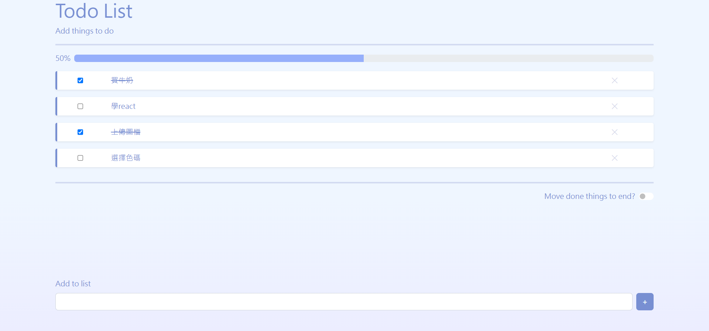

# Todo List

## 專案概述

使用者可以新增、刪除以及標記完成待辦事項。

## 網頁預覽



>*此專案為純前端，且在本地端( localhost )執行。

## 安裝方式

下載完成後在專案安裝 modules。

```
yarn install
```
或
```
npm install
```

## 啟動方式

```
yarn start
```
或
```
npm start
```
